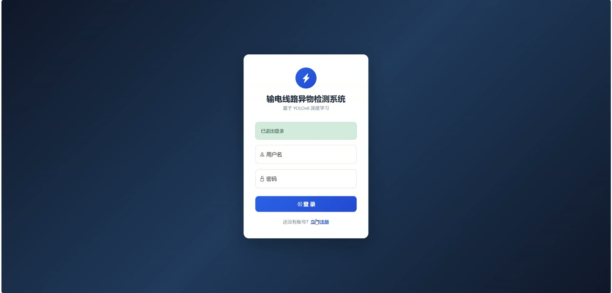
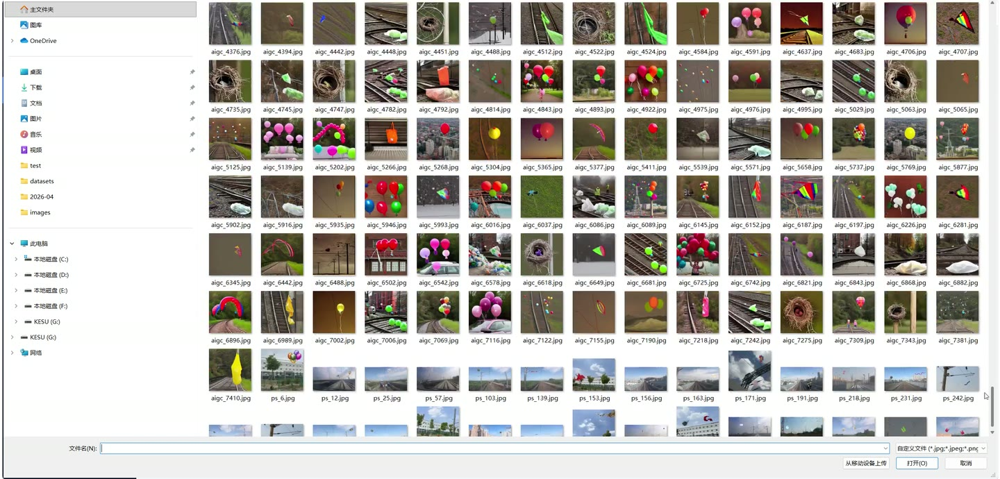
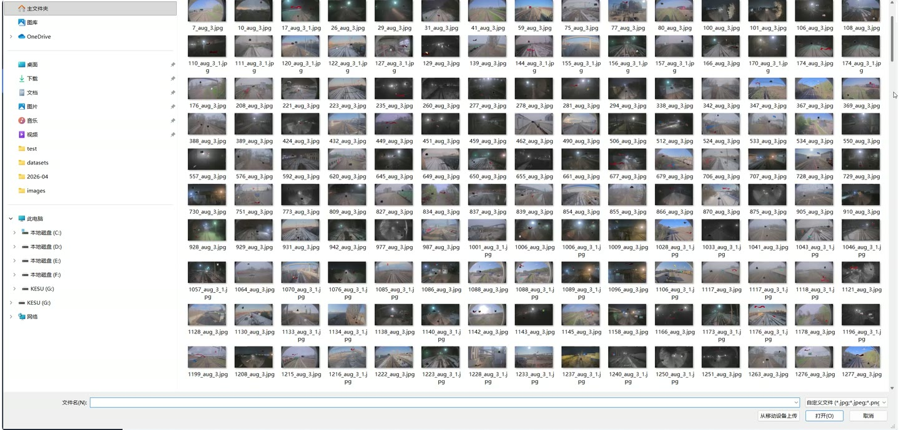
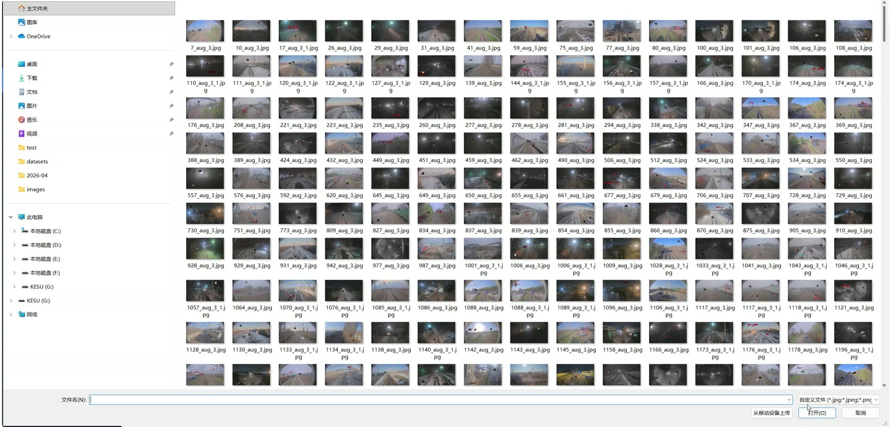
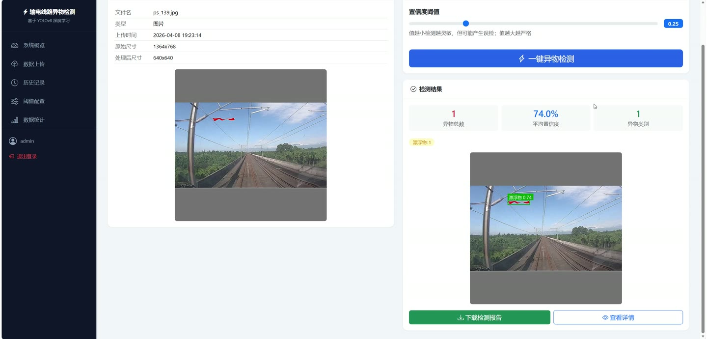

# (附文档)Python+YOLO+深度学习 基于 YOLOv8 深度学习的输电线路异物检测系统

**技术栈**：Python、Flask、PyTorch、YOLO、深度学习、MySQL

### 系统简介

本系统是基于 YOLOv8 深度学习模型构建的输电线路异物检测平台，采用 Flask 后端 + MySQL 数据库的前后端分离架构，支持图片与视频两类数据的异物智能识别。系统包含普通用户端与管理员端两类角色，覆盖数据上传、预处理、一键检测、结果可视化、PDF 报告导出、历史记录查询等完整业务链路。
 
### 核心功能
 
### 普通用户端

 
- 用户注册：填写用户名、密码、确认密码，校验用户名长度 2-20 字符、密码至少 6 位、两次密码一致、用户名唯一。 
- 用户登录：输入用户名与密码进行身份校验，支持 remember 记住登录状态，未登录访问业务页面自动跳转登录页。 
- 退出登录：一键销毁当前会话并返回登录页。 
- 系统概览仪表盘：展示检测记录总数、异物检出总数、最近 5 条检测记录以及按类别聚合的异物统计。 
- 数据上传：支持 png/jpg/jpeg/bmp/tiff 图片与 mp4/avi/mov/mkv/flv 视频，单文件上限 200MB，上传后生成唯一 record_id 并落库。 
- 图像预处理：对上传图片执行预处理并记录原始尺寸、处理后尺寸等预处理信息。 
- 视频抽帧预处理：对上传视频按帧抽取并保存至独立目录，供后续逐帧检测。 
- 一键检测：在检测页面对已上传文件触发检测，可自定义置信度阈值 conf_threshold。 
- 图片检测：调用 YOLOv8 模型对预处理后图片进行异物检测，输出标注结果图并保存至 results 目录。 
- 视频检测：对抽取的视频帧批量检测，输出带标注的帧图像序列并汇总检测结果。 
- 检测结果可视化：查看标注结果图、检测详情（类别、中文名、置信度、bbox）以及统计信息（总数、按类别计数、平均置信度）。 
- PDF 报告下载：根据检测结果自动生成 PDF 报告并支持在线下载。 
- 历史记录查询：按检测时间倒序查看历史检测记录，支持按文件类型等条件检索。 
- 记录详情查看：查看单条记录的原始文件名、文件类型、检测时间、异物总数、使用的置信度阈值等字段。
 
### 管理员端

 
- 默认管理员账号：系统初始化时内置 admin 账号，密码为 admin123，可直接登录后台。 
- 系统配置管理：维护 conf_threshold 置信度阈值与 iou_threshold IoU 阈值两项核心检测参数。 
- 阈值持久化：检测器启动时自动从 system_config 表读取阈值配置并加载到检测实例。 
- 用户数据管理：通过 users 表统一管理注册用户账号、密码哈希与注册时间。 
- 检测记录管理：通过 detection_records 表管理全部检测记录的路径、统计、详情与报告字段。 
- 模型权重管理：通过 models 目录下的 best.pt 权重文件控制线上使用的检测模型。 
- 类别字典维护：通过配置中的类别中文名映射维护鸟巢、塑料袋、漂浮物、气球四类异物的展示名称。 
- 数据存储配置：通过 config.py 统一管理上传、结果、报告三类文件存储目录与数据库连接参数。
 
### 技术栈

 后端框架Flask ORMFlask-SQLAlchemy 权限认证Flask-Login + Werkzeug 密码哈希 深度学习模型YOLOv8（ultralytics） 训练脚本train.py（50 epochs、imgsz 640、batch 16） 数据库MySQL（utf8mb4 / InnoDB） 前端模板Flask Jinja2 模板（login/register/index/upload/detect/result） 报告导出PDF 报告生成模块 文件存储static/uploads、static/results、static/reports
 
### 交付内容

 
- 后端完整源码 
- 前端完整源码 
- 数据库初始化脚本 
- 万字文档

## 界面展示

---

## 获取完整源码 + 万字文档

本仓库为项目介绍页。**完整前后端源码、数据库初始化脚本、万字项目文档**，请加微信 `kangkangcode`，或访问 [codekk.top](http://codekk.top) 获取。

可作课程设计 / 毕业设计参考，支持远程部署调试。